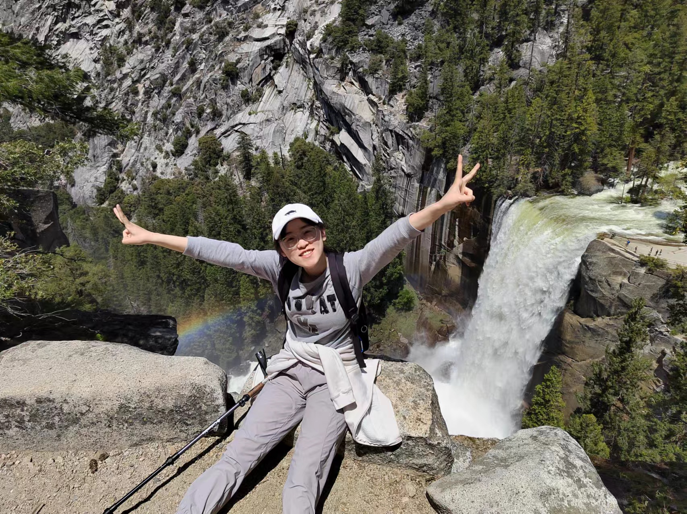

Miscellaneous
=============

Contact
-------
chen-estelle dot deng at connect dot polyu dot hk

Besides Research
-------
Outside of my academic pursuits, I am passionate about exploring diverse sports, with a particular love for badminton, skateboarding, snowboarding, and swimming. These activities not only keep me active but also inspire creativity and resilience.

I am also drawn to the beauty of nature and enjoy hiking as a way to recharge and connect with the outdoors.

In my downtime, I immerse myself in books, with a special fondness for sci-fi, detective, and romance novels. One of my favorite authors is Agatha Christie.

Links
-----

`My ORCiD <https://orcid.org/0000-0003-4241-0780>`_

`APSS HKPolyU <https://www.polyu.edu.hk/apss/>`_ 
